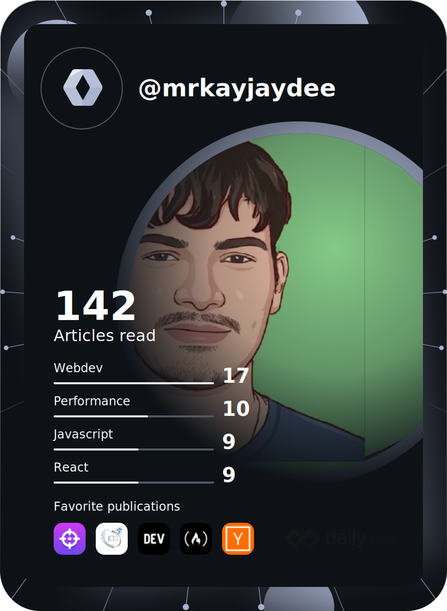

<h1>Hi everyone, I'm Mr¤KayJayDee</h1>

  
  
I'm a French 20-year-old developer who is always eager to learn new languages and explore new things. Here are a few pieces of information about me. 😉

  <h3>My portfolio is here if you want to see what I'm up to: <a href="http://portfolio.killiandalcin.fr">portfolio.killiandalcin.fr</a>
    <h2>Links:</h2>
  </h3>
  <ul>
    <li>
      <strong>Discord:</strong> Mr¤KayJayDee#8961
    </li>
    <li>
      <strong>Support Server:</strong>
      <a href="https://discord.gg/5ZSGFYtnqw">discord.gg/5ZSGFYtnqw</a>
    </li>
    <li>
      <strong>Shop Server:</strong>
      <a href="https://discord.gg/X2CHqpFPjw">discord.gg/X2CHqpFPjw</a>
    </li>
    <li>
      <strong>Instagram:</strong>
      <a href="https://www.instagram.com/killian.dalcin">@killian.dalcin</a>
    </li>
    <li>
      <strong>Snapchat:</strong>
      <a href="https://www.snapchat.com/add/killian.dalcin">@killian.dalcin</a>
    </li>
    <li>
      <strong>Twitter:</strong>
      <a href="https://twitter.com/killiandalcin">@killiandalcin</a>
    </li>
    <li>
      <strong>GitHub:</strong>
      <a href="https://github.com/Mr-KayJayDee/">github.com/Mr-KayJayDee/</a>
    </li>
    <li>
      <strong>Portfolio:</strong>
      <a href="https://portfolio.killiandalcin.fr">portfolio.killiandalcin.fr</a>
    </li>
    <li>
      <strong>Fiverr:</strong>
      <a href="https://www.fiverr.com/mr_kayjaydee">fiverr.com/mr_kayjaydee</a>
    </li>
    <li>
      <strong>Email:</strong>
      <a href="mailto:killian.dalcin@gmail.com">killian.dalcin@gmail.com</a>
    </li>
    <li>
      <strong>Professional Email:</strong>
      <a href="mailto:contact@killiandalcin.fr">contact@killiandalcin.fr</a>
    </li>
  </ul>

<h1>My Skills</h1>

 Programming languages  
  

 Frontend frameworks  
  

 Databases  
  

 Technologies  
  

 Socials  
  

 OSes  
  

 Dev Tools  
  

